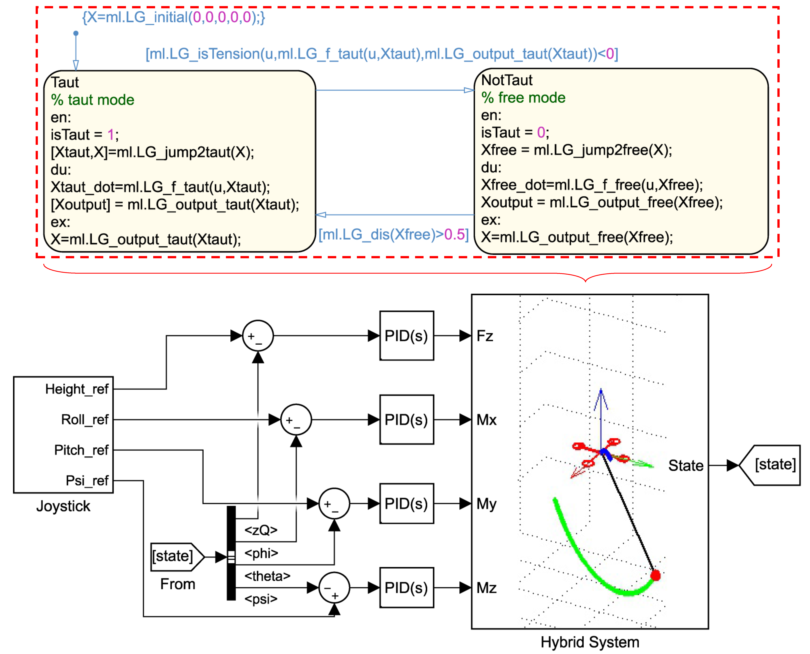

# Joystick-Hybrid-System-Animation

Matlab 2017b
by Minhuan

### Functions:
1. A hybrid model of single quadrotor carrying a cable-suspended payload is built.
2. Four PID controllers are designed for different channels.
3. A real-time 3D animation is designed.

### How to use it:
1. Open "HybridSystem_Plant_Joystick.slx".
2. Connect PC with a joystick such as XboX.
3. Click "Run"
4. User can then control the quadrotor in its height, roll, pitch and yaw channels in real-time. Meanwhile, a real-time 3D animation is created automaticlly.
